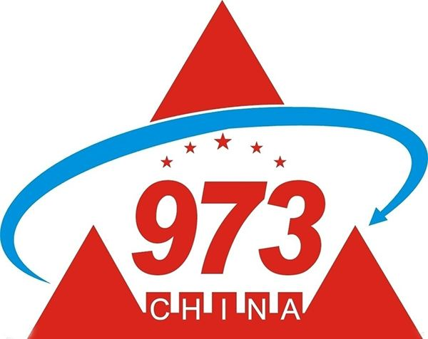

# Chenyu Yan

MS, Xi'an Jiaotong University, PRC

 <leo-chenyu.yan@stu.xjtu.edu.cn> 

## Education Background

I received BS degree with Electrical Engineering and Automation (GPA: 3.7, 1/91) from [Northwestern Polytechnical University(NPU)](http://zdhxy.nwpu.edu.cn/English/English/Home.htm) in People Republic of China(PRC) in June 2016 and the topic of thesis is "Design of large scale Lithium-ion battery stack management system based on ARM". I received MS degree with Electrical Engineering (GPA: 3.7, 2/51) from [Xi'an Jiaotong University(XJTU)](http://ee.xjtu.edu.cn/English_Version1/home.htm) in PRC in June 2019 and the topic of thesis is "Research on Electrical Breakdown Property of Polypropylene Nanocomposite Dielectric Modulated by Charge Transport and Molecular Displacement". 

During master's study,  I was in Prof. [Shengtao Li](http://gr.xjtu.edu.cn/web/sli/23;jsessionid=3EE36B730115F7EC2AB0CDF2C0723015)'s group and my  research focused on  property analysis of power equipment and charge transport modeling calculation. Different from intensive researches on enhancing breakdown performance of power equipment, I attach more emphasis on modeling the breakdown process and demonstrate the hidden mechanism. In  past 3 years, apart from the basic investigation towards electrical property of equipment, I also have a form the good ability for coding and mathematical modeling. Under my prof. [Daomin Min](http://gr.xjtu.edu.cn/web/sli/22)'s guidance, I gradually formulated ability to deal with academic research and got a deeper insight towards my research. During this period, I was involved in 3 projects and have 15 papers published.

## Publications 

 [My Research Gate](https://www.researchgate.net/profile/Chenyu_Yan4) 

1. Min DM, <u>**Yan CY**</u>, Huang Y, et.al. Dielectric and carrier transport properties of silicone rubber degraded by gamma irradiation[J]. Polymers, 2016, 9(10): 1-15 (SCI: 000414913800071; EI: 20174304306504)
2. Min DM, <u>**Yan CY**</u>, Mi R, et.al. Carrier Transport and Molecular Displacement Modulated dc Electrical Breakdown of Polypropylene Nanocomposites[J]. Polymers, 2018, 10(11): 1-20 (SCI: 000454456800029; EI: 20184606058526) 
3. Min DM, Li YW, <u>**Yan CY**</u>, et.al. Thickness Dependent dc Electrical Breakdown of Polyimide Modulated by Charge Transport and Molecular Displacement[J], 2018, Polymers, 10(9): 1-18 (SCI: 000449988800081; EI: 20183805840118)
4. Min DM, <u>**Yan CY**</u>, Wang WW, et al. Electrical breakdown of polymer nanocomposites modulated by space charges[C]. IEEE 17th International Conference on Nanotechnology, 2017: 267-269 (EI: 20180604700270)
5. Xie DR, <u>**Yan CY**</u>, Huang Y, et al. Study on short-term dc breakdown and corona resistance mechanism of polyimide. Proceedings of 2017 International Symposium on Electrical Insulating Materials, 2017: 437-441 (EI: 20180704798615) 
6. Kang WB, **<u>Yan CY</u>**, Li ST, et al. Trap and carrier transport of pristine and aged silicone rubber by surface potential measurements[C]. Proceedings of 2017 International Symposium on Electrical Insulating Materials, 2017: 207-210 (EI: 20180704798674)
7. Li SJ, Yan W, <u>**Yan CY**</u>, et al. Surface trap and carrier transport of aged and pristine oil-paper under harmonic voltage by surface potential decay[C]. IEEE Conference on Electrical Insulation and Dielectric Phenomenon, 2017:94-97 (EI: 20181505007629) 
8. Cheng L, Chi XH, <u>**Yan CY**</u>, et al. Polypropylene nanocomposite for power equipment: a review[J]. IET Nanodielectrics, 2018, 1(2): 92-103 
9. Min DM, <u>**Yan CY**</u>, Huang Y, et.al. Influence of filler content on conductivity of epoxy resin nanocomposites[C]. The 20th International Symposium on High Voltage Engineering, 2017: 1-6
10. Min DM, <u>**Yan CY**</u>, Mi R, et al. Space-charge modulated electrical breakdown in polyethylene nanodielelctrics[J]. IEEE Nanotechnology Magazine, 12(2): 15-22.
11. Mi R, <u>**Yan CY**</u>, Wu QZ, Min DM, Li ST. Effect of deep traps and molecular motion on dc breakdown of polyethylene nanocomposites[C]. IEEE Conference on Electrical Insulation and Dielectric Phenomenon 2019 
12. Li YW, <u>**Yan CY**</u>, Min DM, Li ST. Numerical simulation on dc breakdown of polyimide based on charge transport and molecular chain displacement[C]. IEEE Conference on Electrical Insulation and Dielectric Phenomenon 2019
13. Kang WB, Meng SX, Cui HZ, Li YW, Mi R, <u>**Yan CY**</u>, Min DM, Li ST. Space charge accumulation in silicone rubber influenced by Poole-Frenkel effect[C]. International Conference on novel functional materials, 2018: 1-5 (EI: 20185306321507)
14. Cui HZ, Xing ZL, Wu QZ, <u>**Yan CY**</u>, Mi R, Min DM, and Li ST. Accumulation of space charges in epoxy resin nanodielectrics influenced by Poole-Frenkel effect, International Conference on novel functional materials 2019 
15. Kang WB, Meng SX, Cui HZ, <u>**Yan CY**</u>, Min DM, Li ST. Trap and dielectric property evolution of silicone rubber insulation under power frequency voltage superimposed harmonic [J]. High voltage (Chinese)  

- **Min DM is my professor in the group**

## Scholarship and Awards 

### Scholarship ### 

1. National Scholarship	2018.11 & 2017.11
2. First class scholarship    2018.11 & 2017.11
3. Scholarship for excellent freshman    2016.09
4. Provincial special scholarship    2015.09
5. First class scholarship    2015.09 & 2014.09 & 2013.09
6. E+H special scholarship    2014.09

### Awards ###

1. Outstanding graduated student    2019.06
2. Merit master student award    2018.11 & 2017.11
3. National Mathematical Contest in Modeling for Graduated students, Honorable mention    2017.11
4. Outstanding graduated student    2016.06
5. The 5th session of MathorCup Mathematical Contest in Modeling, Outstanding award    2015.06
6. International Mathematical Contest in Modeling (MCM), Honorable mention    2015.03
7. National Mathematical Contest in Modeling, Outstanding award    2014.11
8. Best debater in debate competition in China   2014.10
9. Excellent world teenager in Japan, Korea and China forum    2014.09
10. Merit student award    2015.11 & 2014.11 & 2013.11
11. National innovation training program, first class award, 2014.04 & 2015.04 & 2016.04

## Project Experience ##

- **Influence of molecular chain motion property in interfacial regions on dc breakdown property of polyethylene nanocomposites (National Natural Science Foundation of China) ** 

This project was originated from the need for enhancing breakdown property of polyethylene to meet up with its demand for high voltage power transmission. Based on the motion property of molecular chains at the interfacial regions, this study investigated its impact on dc breakdown property of polyethylene nanocomposites and revealed the mechanism of PE breakdown. I'm responsible for model compiling and paper writing(academic paper and project report.

- **Insulating property and its regularity of dielectrics in current transfer and energy dissipation (National Key Basic Research Program (973) sub-project)** 

​                                                                                  

This project investigated the coupling impact of space charge accumulation, transient arc micro particle bombardment, metal particle deposition on the falshover property of fractrue insulating system in the process of dc arc switching, and revealed its influence regularity and failure mechanism. Study figured out the the methods to suppress the space charge accumulation and metal particle deposition in the fracture insulating system and proposed approaches to resist flashover damage and aging. This research provided the theoretical and technology support for enhancing the voltage, current as well as lifespan of circuit breaker. I was mainly involved in the modeling of energy accumulation and flashover process, and investigated the influence of charge transport parameters and temperature on flashover behavior.

- **Charge transport property in silicone rubber under harmonic aging (Project of China Electric Power Research Institute)** 

This project was originated from the need that power equipment like cable and bush are easier to be aged under the high-order harmonics, which hence deteriorated the performance of power system. The study, taking the silicon rubber from the outer coat of cable terminals and the insulating oil paper in the bush as the research objects, quantificationally manifested the aging status and summarized the insulating material deterioration regularity. In addition, aging model for cable and bush were proposed to predict their odd lifespans and the mechanism of aging has been demonstrated. I was responsible for experiment design,  modeling calculation and paper writing.

## Work Experience and Internship ## 

**State Grid Corporation of China		Department of Information and Internet		2019.09 - Now** 

I worked in State Grid Corporation of China (SGCC), known as the largest power corporation in China, for half a year. In this period, I worked as a member in Department of Information and Internet, which focuses on data collection and processing to propose practical suggestions for the development of corporation. I have been involved in a project to predict short-term load of grid power, including day load forecast and workload forecast. This work aimed at suppressing illegal electric larceny especially in corporation with relatively higher demand for electric resources, so that the lost profits can be reclaimed and SGCC also has a greater power to better distribute the power transmission. In this project, I was responsible for forecast modeling and data processing, which provided the basis of prediction. Specifically, with previous data of electric usage as the input, model was based on RNN and LSTM model to forecast the electric demand for following 7 days. By comparing with realistic values, it was proved that model had a relatively high precision and value of MAPE was around 2.1%. This can be a relative basis for following study regarding the machine learning and artificial intelligence, which is promising to foster interdisciplinary disciplines.

**Asea Brown Boveri Ltd., China         Electrical Engineer Internship                       2016.05-2016.09** 

​                                                                           	

I was an internship of technology department in ABB for four months. During this period, I have the initial understanding of industrialization of power system, especially the power capacitor. With an increase in familiarity with equipment, I have a more lucid concept for structure of power system and commercial market in this field. Plus, with the support of investigation in the equipment workshop, I learned the processing flow of capacitor, starting from the polypropylene film fabrication to the component assembly. In addition, I also got an opportunity to be engaged in the technical discussion with foreign experts, which largely bring inspiration to my further exploration on the research. Through intensive discussion, I found that increasing demand for high voltage transmission had been an urgent need for the grids in China, property of electric breakdown, however, was a key factor that determined the performance of power capacity. Therefore, when choosing the major field in my master phase, I forwardly approached to my professor and expressed my plan on the research of breakdown property of polypropylene. Different from most researches, I attached more emphasis on the simulation and modeling calculation, which can reveal the interior mechanism and bring more novel ideas to this field. One more thing, it is worth being mentioned that I developed a program based on C++ during my internship to help collecting documents to meet the needs of engineers, which has been integrated to the system of ABB and used until now.

## Skill Highlight ## 

During the learning and research in past few years, I had a deeper insight into the academic research and the desire to explore the unknown. 

1. Data processing and modeling

   Mathematical model competition and previous research help to form a good sense of mathematical thinking and modeling basis. I can adroitly use data processing and coding tools including Python, R, TensorFlow, Origin, SPSS, MATLAB, etc., which provide a good basis for calculation and modeling. Productive data processing and practical models both can pave the way for a clearer demonstration and thus can convey significant messages to the audience. In addition, I'm also learning machine learning and data science on Coursera, which can bring a better computer science basis and positive contributions to my following study in Ph.D phase.

1. Experience in dealing with paper

   Previous work makes me clearly know the layout of the paper and lots of details that need to be paid attention, which can guarantee the quality and productivity of my research in PhD phase. Additionally, I believe that yields in my master can also prove that I can efficiently cope with paper work. In Min's group, on the basis of discussion with my professor, I can independently design my research, including research highlight, route, modeling program and paper writing. 

1. Ability to learn new knowledge

   It is the basic requirement for a Ph.D student to have the ability to grasp the idea or knowledge in a relatively short time for lots of unpredictable problems may arise in the way of research. Benefiting from the competition and research experience, I'm confident that I can do better compared with most students, which is promising to provide more possibility for my research area and even adaptable when switching to a new field.

   
   
   

